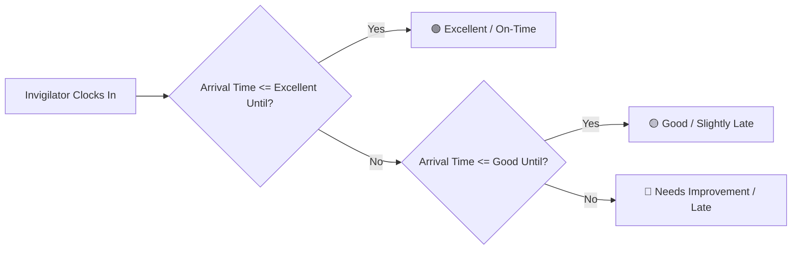

# 🏛️ DutyDesk - Smart Examination Invigilation Management System

[](https://flutter.dev)
[](https://dart.dev)
[](https://firebase.google.com/)
[](LICENSE)

**DutyDesk** is an enterprise-grade, real-time examination invigilation and faculty duty management platform built using Flutter and Firebase. It streamlines the entire examination lifecycle for universities, colleges, and testing centers—from dynamic duty scheduling and multi-center allocations to live GPS-verified attendance, automated punctuality classification, duty swapping, and automated remuneration reporting.

---

## 📑 Table of Contents

- [Key Highlights](#-key-highlights)
- [System Architecture & Features](#-system-architecture--features)
  - [1. Administrator Management Suite](#1-administrator-management-suite)
  - [2. Invigilator & Faculty Portal](#2-invigilator--faculty-portal)
  - [3. Arrival Timing & Punctuality Engine](#3-arrival-timing--punctuality-engine)
  - [4. Mandatory GPS Geofencing System](#4-mandatory-gps-geofencing-system)
  - [5. Reporting & Document Generation](#5-reporting--document-generation)
- [Technology Stack](#-technology-stack)
- [Project Directory Structure](#-project-directory-structure)
- [Getting Started & Installation](#-getting-started--installation)
  - [Prerequisites](#prerequisites)
  - [Setup Instructions](#setup-instructions)
  - [Firebase Configuration](#firebase-configuration)
- [Localization (i18n)](#-localization-i18n)
- [Contributing & License](#-contributing--license)

---

## 🌟 Key Highlights

- ⏱️ **Duty-Level Flexible Timing Config**: Configure distinct `Reporting Time`, `Excellent Until`, and `Good Until` windows independently for every duty, exam, center, and shift.
- 📍 **Mandatory GPS Geofence Verification**: Zero-trust clock-in policy that enforces active location services and geofence radius compliance prior to status updates.
- 📡 **Real-Time Live Control Room**: Real-time admin monitoring dashboard tracking all active sessions, check-in arrivals, late entries, absences, and emergency swap requests.
- 🔄 **Peer-to-Peer Duty Swap Management**: Integrated duty exchange workflow allowing invigilators to request peer replacements with two-way approval and admin visibility.
- 🗣️ **Text-to-Speech (TTS) Voice Briefings**: In-app vocal announcements and audio alerts for upcoming duties and instructions.
- 📊 **Enterprise PDF & Excel Exporting**: Generate official duty allocation slips, center-wise rosters, signature attendance sheets, daily invigilation records, and payroll sheets.
- 🌐 **Multilingual Support**: First-class internationalization support for English, Hindi, and Gujarati.

---

## 🚀 System Architecture & Features

### 1. Administrator Management Suite

- **Dashboard & Analytics**: Live counters for total invigilators, active centers, ongoing exam sessions, completed duties, and daily check-in health.
- **Dynamic Duty Allocation**:
  - Assign invigilators to specific exams, dates, sessions/shifts, and center rooms.
  - Interactive manual time pickers for custom reporting and punctuality threshold windows.
  - Automatic clash and duplicate assignment detection.
- **Live Control Room**:
  - Live status tracking of every assigned invigilator (`ASSIGNED` $\rightarrow$ `REACHED` $\rightarrow$ `COMPLETED`).
  - Color-coded status badges: *Excellent (Green)*, *Good (Amber)*, *Needs Improvement (Red)*, and *Absent/Pending (Grey)*.
  - Instant direct-call and emergency re-allocation triggers.
- **Invigilator & Faculty Management**:
  - Detailed profiles with contact info, department, designation, duty counts, and historical punctuality stats.
  - Availability calendar displaying unavailable dates and scheduled leaves.
- **Center & Room Management**:
  - Multi-center registry with latitude/longitude coordinates, geofence radius, room counts, and contact coordinates.
- **Payroll & Remuneration**:
  - Automated payout calculations based on completed sessions, base rates, and shift types.
- **Master Data & System Maintenance**:
  - Bulk data cleanup, database backup, test data seeding, and audit logs.
- **Global Search**:
  - Unified search engine indexing invigilators, centers, sessions, and duty allocations in real time.

---

### 2. Invigilator & Faculty Portal

- **Live Duty Dashboard**:
  - Clean, prioritized view of upcoming, today's, and past duty allocations.
  - Real-time countdown timer to reporting time.
  - Center details with deep-links to map directions and center contact numbers.
- **GPS-Verified "Reached" Clock-In**:
  - One-tap arrival confirmation strictly validated against center GPS coordinates.
  - Immediate audio-visual feedback on arrival punctuality.
- **Peer Duty Swap Engine**:
  - Submit swap requests to eligible colleagues for specific sessions.
  - Accept or decline incoming swap invitations with instant roster updates.
- **Audio Announcements & Notifications**:
  - Text-to-speech briefing of duty instructions and reporting guidelines.
  - Push-style in-app notification center for schedule changes and allocations.

---

### 3. Arrival Timing & Punctuality Engine

DutyDesk does not enforce rigid or fixed shift timings. Instead, administrators configure exact arrival milestones per duty allocation:

| Threshold Field | Purpose | Example |
| :--- | :--- | :--- |
| **Reporting Time** | The expected earliest arrival and reporting time | `05:00 AM` |
| **Excellent Until** | Deadline for the highest punctuality rating (*Excellent / On-Time*) | `06:20 AM` |
| **Good Until** | Deadline for acceptable arrival (*Good / Slightly Late*) | `06:30 AM` |

#### **Arrival Quality Classification Matrix**:


---

### 4. Mandatory GPS Geofencing System

To maintain absolute integrity of examination centers:
1. **Device Location Enforced**: Clock-in is strictly blocked if GPS location services are disabled on the device.
2. **Permission Check**: Automatically requests `LocationPermission.whileInUse` / `always`.
3. **Geofence Validation**: Calculates the high-precision geodesic distance between the device coordinates and the center's configured coordinates.
4. **Tamper Prevention**: Rejects clock-in attempts if outside the permitted center boundary (configurable, default: 200m).

---

### 5. Reporting & Document Generation

DutyDesk provides built-in PDF and Excel rendering engines:
- 📄 **Duty Allotment Slips (PDF)**: Printable duty orders with official university/college headers, invigilator details, reporting timings, and signature lines.
- 📋 **Daily Center Invigilation Record (PDF)**: Comprehensive daily log of all rooms, allocated staff, clock-in times, and arrival quality badges.
- 📊 **Excel Roster Export (.xlsx)**: Raw tabular datasets of allocations, reporting windows, check-in timestamps, and contact data for institutional archiving.

---

## 🛠️ Technology Stack

| Layer | Technology |
| :--- | :--- |
| **Framework** | [Flutter](https://flutter.dev) (v3.11+) |
| **Language** | [Dart](https://dart.dev) (v3.0+) |
| **State Management** | [Flutter Riverpod](https://pub.dev/packages/flutter_riverpod) / `hooks_riverpod` |
| **Backend & Database** | [Google Cloud Firestore](https://firebase.google.com/docs/firestore) |
| **Authentication** | [Firebase Authentication](https://firebase.google.com/docs/auth) |
| **Routing** | [GoRouter](https://pub.dev/packages/go_router) |
| **Location & Geofencing** | [Geolocator](https://pub.dev/packages/geolocator) |
| **Speech & Audio** | [Flutter TTS](https://pub.dev/packages/flutter_tts) |
| **Reporting & Export** | [pdf](https://pub.dev/packages/pdf), [printing](https://pub.dev/packages/printing), [excel](https://pub.dev/packages/excel) |
| **Communications** | [Mailer](https://pub.dev/packages/mailer) (SMTP), [url_launcher](https://pub.dev/packages/url_launcher) |
| **Typography & UI** | [Google Fonts](https://pub.dev/packages/google_fonts), Custom Material 3 Design |

---

## 📂 Project Directory Structure

```plaintext
DutyDesk/
├── android/                         # Android native configurations & permissions
├── assets/                          # Static assets, branding & logos
│   └── images/
│       └── logo.png
├── lib/
│   ├── core/                        # Shared infrastructure & core services
│   │   ├── providers/               # Global state providers (language, theme)
│   │   ├── router/                  # GoRouter declarative navigation
│   │   ├── services/                # Location, TTS, Offline Sync & SMTP
│   │   ├── theme/                   # Material 3 design tokens & color schemes
│   │   └── utils/                   # DateTime, formatting & filter utilities
│   ├── features/
│   │   ├── admin/                   # Administrator modules
│   │   │   ├── presentation/        # Dashboards, Duty Allocation, Control Room, etc.
│   │   │   ├── providers/           # Exam session, center, invigilator & settings state
│   │   │   └── services/            # PDF and Excel report generation services
│   │   ├── auth/                    # Authentication, login & splash screens
│   │   ├── invigilator/             # Invigilator portal
│   │   │   ├── presentation/        # Invigilator dashboard & clock-in screen
│   │   │   └── providers/           # Duty tracking & swap request providers
│   │   └── notifications/           # In-app notification center
│   ├── l10n/                        # Localization ARB files (en, hi, gu)
│   ├── firebase_options.dart        # Firebase CLI auto-generated configuration
│   └── main.dart                    # Application entry point
├── l10n.yaml                        # Flutter localization config
├── pubspec.yaml                     # Dependencies and asset declarations
└── README.md                        # Documentation
```

---

## 🏁 Getting Started & Installation

### Prerequisites

- [Flutter SDK](https://docs.flutter.dev/get-started/install) (`>= 3.11.4`)
- [Dart SDK](https://dart.dev/get-dart) (`>= 3.0.0`)
- [Firebase CLI](https://firebase.google.com/docs/cli) & an active Firebase Project
- Android Studio / Xcode / VS Code with Flutter extensions

### Setup Instructions

1. **Clone the Repository**:
   ```bash
   git clone https://github.com/rajnishsinh2003/DutyDesk.git
   cd DutyDesk
   ```

2. **Install Dependencies**:
   ```bash
   flutter pub get
   ```

3. **Generate Localization Files**:
   ```bash
   flutter gen-l10n
   ```

4. **Run Code Analysis**:
   ```bash
   flutter analyze
   ```

5. **Run the Application**:
   ```bash
   flutter run
   ```

---

### 🔥 Firebase Configuration

1. Create a new Firebase project in the [Firebase Console](https://console.firebase.google.com/).
2. Enable **Authentication** (Email/Password).
3. Enable **Cloud Firestore** and deploy standard security rules.
4. Configure FlutterFire using the CLI:
   ```bash
   flutterfire configure
   ```
5. Place `google-services.json` in `android/app/` (for Android) and `GoogleService-Info.plist` in `ios/Runner/` (for iOS).

---

## 🌐 Localization (i18n)

DutyDesk supports dynamic runtime language switching across 3 languages:
- 🇬🇧 **English** (`app_en.arb`)
- 🇮🇳 **Hindi** (`app_hi.arb`)
- 🇮🇳 **Gujarati** (`app_gu.arb`)

Translations are managed via Flutter's standard `flutter_localizations` toolchain located in `lib/l10n/`.

---

## 📄 License

This project is licensed under the MIT License - see the [LICENSE](LICENSE) file for details.

---

<div align="center">
  <sub>Developed with ❤️ for seamless exam administration.</sub>
</div>
