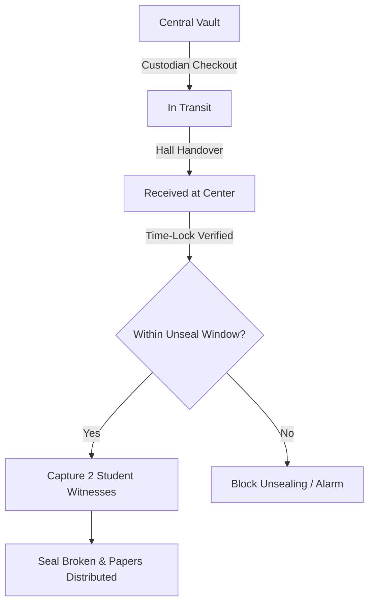

# 🏛️ DutyDesk — Smart Examination Invigilation & Operations Management System

[](https://flutter.dev)
[](https://dart.dev)
[](https://firebase.google.com/)
[](LICENSE)
[-success?style=for-the-badge)](feature_audit.md)
[](https://flutter.dev)

**DutyDesk** is an enterprise-grade, real-time examination administration, invigilation duty lifecycle, and exam security operations platform built using **Flutter (Material 3)** and **Google Cloud Firestore**. 

It standardizes the end-to-end examination lifecycle for universities, colleges, boards, and state testing agencies—spanning automated duty allocations, paper dispatch chain-of-custody, tamper-evident answer script reconciliation, BLE & GPS geofenced attendance, AI/biometric verification, CCTV surveillance, emergency standby promotions, statutory audit logs, and candidate exam portals.

---

## 📑 Table of Contents

- [🌟 Comprehensive Feature Matrix (39/39 Complete)](#-comprehensive-feature-matrix-3939-complete)
- [🏗️ Key Systems & Modules](#️-key-systems--modules)
  - [1. Examination Security & Dispatch Chain of Custody](#1-examination-security--dispatch-chain-of-custody)
  - [2. Answer Script Reconciliation & Form B Docket](#2-answer-script-reconciliation--form-b-docket)
  - [3. Seating Plan Engine (Anti-Cheating & 2D Grid)](#3-seating-plan-engine-anti-cheating--2d-grid)
  - [4. Bulk Data Import Engine (.xlsx / .csv)](#4-bulk-data-import-engine-xlsx--csv)
  - [5. Audit Trail & Immutable System Activity Log](#5-audit-trail--immutable-system-activity-log)
  - [6. Role-Based Specialized Dashboard Variants (COE, Vigilance, Dean)](#6-role-based-specialized-dashboard-variants-coe-vigilance-dean)
  - [7. CCTV Surveillance Monitor](#7-cctv-surveillance-monitor)
  - [8. Parent & Student Examination Portal](#8-parent--student-examination-portal)
  - [9. Biometric, Geofence, BLE & Gate Access Verification](#9-biometric-geofence-ble--gate-access-verification)
  - [10. Standby Promotion & Live Control Room](#10-standby-promotion--live-control-room)
- [🛠️ Technology Stack](#️-technology-stack)
- [📂 Project Architecture](#-project-architecture)
- [🏁 Getting Started & Setup](#-getting-started--setup)
- [🌐 Internationalization (i18n)](#-internationalization-i18n)
- [📄 License](#-license)

---

## 🌟 Comprehensive Feature Matrix (39/39 Complete)

| # | System Module | Capabilities & Workflow | Status |
|:--|:--------------|:------------------------|:------:|
| 1 | **Firebase Auth & RBAC** | Email/password, 4 primary roles + specialized variants, auto-routing | ✅ Production |
| 2 | **Admin Dashboard** | Executive KPIs, attendance health, conflict alerts, quick actions | ✅ Production |
| 3 | **Invigilator Dashboard** | Duty timeline, acceptance/rejection, countdown timers, clock-in | ✅ Production |
| 4 | **Duty Allocation Engine** | Auto-fairness algorithm, manual overrides, clash detection | ✅ Production |
| 5 | **Center Management** | Multi-center CRUD, geo-coordinates, room counts, contact coordinates | ✅ Production |
| 6 | **Invigilator Directory** | Faculty profiles, past punctuality metrics, department/designation | ✅ Production |
| 7 | **Peer Duty Swap System** | Two-way peer exchange requests, admin oversight, roster updates | ✅ Production |
| 8 | **Live Control Room** | Real-time session monitoring, arrival quality tracking, instant dial | ✅ Production |
| 9 | **Payroll & Remuneration** | Automated session rate math, TA/DA config, bank detail tracking | ✅ Production |
| 10 | **Reports & Analytics** | PDF duty allotment slips, daily room logs, Excel (.xlsx) roster export | ✅ Production |
| 11 | **Duty Settings** | Global geofence radius, swap windows, honorarium rates configuration | ✅ Production |
| 12 | **In-App Notification Center**| Real-time alerts, unread badge counter, announcement broadcasts | ✅ Production |
| 13 | **Incident Management** | Malpractice, technical, medical reporting, severity tags, resolution notes | ✅ Production |
| 14 | **Mandatory GPS Clock-In** | High-precision geodesic distance check, zero-trust geofence enforcement | ✅ Production |
| 15 | **TTS Voice Briefings** | Text-to-speech duty instructions and reporting advisories | ✅ Production |
| 16 | **Offline Sync Engine** | SQLite/local cache queue for intermittent campus connectivity | ✅ Production |
| 17 | **SMS / WhatsApp Gateway** | Msg91, Fast2SMS, Twilio, and WhatsApp notification adapters | ✅ Production |
| 18 | **SMTP Email Dispatch** | Automated duty allotment notices via SMTP mail service | ✅ Production |
| 19 | **Data Archival & Purge** | Semester-end archival, database backup, test data seeding | ✅ Production |
| 20 | **Master Data Records** | Multi-entity management (Guards, Exam Staff, Jammers, PODs, Works) | ✅ Production |
| 21 | **Global Search** | Unified indexing across duties, staff, centers, and incident tickets | ✅ Production |
| 22 | **Availability Calendar** | Monthly faculty availability calendar, leaves, blackout dates | ✅ Production |
| 23 | **Multilingual (i18n)** | English, Hindi (हिन्दी), and Gujarati (ગુજરાતી) runtime switching | ✅ Production |
| 24 | **Biometric Face Verification**| Device camera preview, face alignment frame, spoof protection | ✅ Production |
| 25 | **Digital Gate Pass & QR Badge**| Dynamic QR badge generation with cryptographic duty tokens | ✅ Production |
| 26 | **Gate Pass QR Scanner** | Security guard barcode/QR verification console at campus entry gates | ✅ Production |
| 27 | **BLE Beacon Proximity** | Bluetooth Low Energy room proximity checks for in-room presence | ✅ Production |
| 28 | **WhatsApp Hub & Webhooks** | Interactive broadcast console and two-way webhook trigger console | ✅ Production |
| 29 | **FCM Push Notifications** | Background and foreground cloud messaging, topic subscriptions | ✅ Production |
| 30 | **Statutory Auditor Dashboard**| Observer mode, readiness inspection scorecards, read-only compliance | ✅ Production |
| 31 | **Standby Promotion Engine** | Automated no-show replacement, grace period timers, standby pool | ✅ Production |
| 32 | **Exam Seating Plan Generator**| 2D Hall grid, roll-number rollouts, anti-cheating roll spacing, PDF/CSV | ✅ Production |
| 33 | **Paper Dispatch Tracker** | Vault checkout, chain of custody, time-locked OTP/witness unsealing | ✅ Production |
| 34 | **Answer Sheet Collection Log**| Mathematical script reconciliation, absentee tracking, Form B Docket PDF | ✅ Production |
| 35 | **Bulk Data Import Engine** | Drag-and-drop Excel/CSV batch importer, auto-mapping, conflict policy | ✅ Production |
| 36 | **Audit Trail & Activity Log** | Immutable chronological administrative action logs, category filters | ✅ Production |
| 37 | **Specialized Dashboards** | Custom executive portals for COE, Flying Squad, and Dean/Principal | ✅ Production |
| 38 | **CCTV Surveillance Monitor** | Live IP camera feeds, 2×2 / 3×3 grid, full-screen inspect, REC indicators | ✅ Production |
| 39 | **Student & Parent Portal** | Read-only candidate exam schedules, seat allocation, exam guidelines | ✅ Production |

---

## 🏗️ Key Systems & Modules

### 1. Examination Security & Dispatch Chain of Custody
Tracks question paper packets from the central vault through transit to the exam hall:
- **Vault Checkout**: Timestamped barcode scanning and custodian verification.
- **Transit Verification**: Driver & escort logging with expected arrival windows.
- **Time-Locked Unsealing**: Enforces that packets can only be opened within the scheduled window (e.g., 30 minutes before exam start).
- **Two Student Witnesses**: Captures candidate roll numbers and names before digital seal breaking.
- **Tamper Incident Filing**: Immediate escalation for torn envelopes, compromised seals, or discrepancies.


```mermaid
graph TD
    A[Central Vault] -->|Custodian Checkout| B[In Transit]
    B -->|Hall Handover| C[Received at Center]
    C -->|Time-Lock Verified| D{Within Unseal Window?}
    D -- Yes --> E[Capture 2 Student Witnesses]
    D -- No --> F[Block Unsealing / Alarm]
    E --> G[Seal Broken & Papers Distributed]
```

---

### 2. Answer Script Reconciliation & Form B Docket
Eliminates script counting errors and missing answer sheet incidents post-examination:
- **Strict Reconciliation Math**:
  $$\text{Distributed} = \text{Present Candidates} + \text{Damaged/Cancelled}$$
  $$\text{Total Candidates} = \text{Collected Scripts} + \text{Absent Count}$$
- **Absentee & Cancelled List**: Itemized roll numbers recorded directly on the bundle.
- **Form B Docket Slip Generation**: Instantly renders official, printable Form B dockets via the PDF engine with QR-coded seals and invigilator signature blocks.
- **Secure Bag Handover**: Sealed tamper-evident bags logged for dispatch to evaluation centers.

---

### 3. Seating Plan Engine (Anti-Cheating & 2D Grid)
- **Interactive 2D Hall Grid**: Configurable rows, columns, and bench layouts for any examination hall.
- **Anti-Cheating Distribution**: Automatically spaces students of identical branches/courses so adjacent desks never share the same subject or test paper set.
- **Hall Notice Board PDF**: One-tap generation of printable seating notices for center entrance display.
- **Student Roll Lookup**: Allows invigilators and students to search their seat by roll number.

---

### 4. Bulk Data Import Engine (.xlsx / .csv)
- **Multi-Entity Ingestion**: Import Invigilators, Exam Centers, Exam Duties, and Security Guards from spreadsheets in seconds.
- **Template Downloader**: Download standardized Excel/CSV templates with sample records.
- **Validation Engine**: Performs pre-commit data sanity checks (email formatting, duplicate IDs, phone numbers).
- **Conflict Resolution**: Choose between `Skip Existing Records`, `Overwrite Existing Records`, or `Abort on Conflict`.
- **Atomic Commits**: Uses Firestore `WriteBatch` operations to commit data safely.

---

### 5. Audit Trail & Immutable System Activity Log
- **Compliance Logging**: Every administrative action (duty edits, swap approvals, payroll disbursements, incident resolutions) is permanently recorded with timestamp, actor UID, role, and metadata.
- **Timeline Visualization**: Grouped by date with color-coded category badges (`Duty Management`, `Payroll`, `Paper Dispatch`, `Answer Sheets`, `Incidents`).
- **Audit Search & Filters**: Filter by category, actor role, or full-text query for audits and legal compliance.

---

### 6. Role-Based Specialized Dashboard Variants (COE, Vigilance, Dean)
- **Controller of Examinations (COE)**: Executive overview of overall attendance rate, dispatch statuses, script reconciliation progress, and no-show alerts.
- **Flying Squad / Vigilance Inspector**: On-ground 10-point inspection checklist, surprise visit tools, gate pass verification, and instant incident filing.
- **Dean / Principal**: Institutional summary of exam operations, staff compliance percentages, and center readiness certificates.

---

### 7. CCTV Surveillance Monitor
- **Multi-Camera Grid**: View 2×2 or 3×3 grids of live IP camera feeds across exam halls, vaults, and entry gates.
- **Live Status & Recording Alerts**: Online/offline heartbeat monitoring and active recording indicators (`● REC`).
- **Center Filter & Full-Screen Inspect**: Filter cameras by building or expand any individual stream for detailed monitoring.

---

### 8. Parent & Student Examination Portal
- **Candidate Schedule**: Access upcoming and completed examination dates, morning/afternoon session timings, center names, and addresses.
- **Seat & Room Lookup**: Find allocated exam room and seat number prior to reporting.
- **Official Exam Guidelines**: Clear dos and don'ts covering permitted stationery, barred electronic devices, reporting time policies, and helpline contacts.

---

### 9. Biometric, Geofence, BLE & Gate Access Verification
- **GPS Geofencing**: Mandatory zero-trust verification checking geodesic distance against center coordinates (configurable 200m radius).
- **Biometric Face Verification**: In-app camera preview with alignment overlay for identity verification at arrival.
- **Digital Gate Pass**: Generates a dynamic QR badge for faculty campus entry.
- **Gate Pass QR Scanner**: Built-in scanning terminal for campus security guards to verify faculty entry passes.
- **BLE Indoor Beacons**: Detects Bluetooth Low Energy beacons inside specific exam rooms to confirm physical hall presence.

---

### 10. Standby Promotion & Live Control Room
- **Arrival Quality Engine**: Independent threshold windows per duty:
  - `Reporting Time` (e.g. 05:00 AM)
  - `Excellent Until` (e.g. 06:20 AM) $\rightarrow$ 🟢 *On-Time*
  - `Good Until` (e.g. 06:30 AM) $\rightarrow$ 🟡 *Slightly Late*
  - Beyond $\rightarrow$ 🔴 *Late / Needs Improvement*
- **Auto-Standby Promotion**: If an invigilator fails to check in within the grace window, the standby promotion engine promotes pre-allocated standby staff automatically and notifies the control room.

---

## 🛠️ Technology Stack

| Layer | Technology |
| :--- | :--- |
| **Framework** | [Flutter](https://flutter.dev) (v3.27+) |
| **Language** | [Dart](https://dart.dev) (v3.6+) |
| **State Management** | [Flutter Riverpod](https://pub.dev/packages/flutter_riverpod) |
| **Database & Auth** | [Google Cloud Firestore](https://firebase.google.com/docs/firestore), [Firebase Auth](https://firebase.google.com/docs/auth) |
| **Routing** | [GoRouter](https://pub.dev/packages/go_router) |
| **Location & Geofencing** | [Geolocator](https://pub.dev/packages/geolocator) |
| **Camera & Hardware** | [Camera](https://pub.dev/packages/camera), [FilePicker](https://pub.dev/packages/file_picker) |
| **Speech & Audio** | [Flutter TTS](https://pub.dev/packages/flutter_tts) |
| **Document Generation** | [pdf](https://pub.dev/packages/pdf), [printing](https://pub.dev/packages/printing), [excel](https://pub.dev/packages/excel) |
| **Communications** | [Mailer](https://pub.dev/packages/mailer) (SMTP), [url_launcher](https://pub.dev/packages/url_launcher) |
| **Internationalization** | `flutter_localizations` (English, Hindi, Gujarati) |

---

## 📂 Project Architecture

```plaintext
DutyDesk/
├── android/                         # Android native configurations & Gradle settings
├── assets/                          # Static brand assets & logos
├── lib/
│   ├── core/                        # Infrastructure, router, themes & core services
│   │   ├── router/app_router.dart   # GoRouter declarative navigation tree
│   │   ├── services/                # Geolocation, BLE, SMS, SMTP, FCM, Archival & Sync
│   │   └── theme/                   # Material 3 dark/light design tokens
│   ├── features/
│   │   ├── admin/                   # Administrator management & allocation suite
│   │   │   ├── presentation/        # Dashboards, bulk import, control room, scanner, etc.
│   │   │   ├── providers/           # Center, invigilator, session, payroll providers
│   │   │   └── services/            # Bulk import, PDF reports, allocation algorithms
│   │   ├── answersheets/            # Answer script reconciliation & Form B docket slip
│   │   ├── audit_trail/             # Immutable administrative activity logging
│   │   ├── auditor/                 # Statutory observer / auditor inspection dashboard
│   │   ├── auth/                    # Firebase authentication, RBAC & login screens
│   │   ├── cctv/                    # Multi-feed IP camera surveillance monitor
│   │   ├── centers/                 # Center hierarchy, room models & readiness certificates
│   │   ├── dispatch/                # Question paper custody & time-locked unsealing
│   │   ├── incidents/               # Real-time incident reporting & resolution
│   │   ├── invigilator/             # Invigilator dashboard, GPS clock-in & swap engine
│   │   ├── notifications/           # Push notifications & in-app notification center
│   │   ├── portal/                  # Student & parent read-only examination portal
│   │   ├── roles/                   # Specialized dashboards (COE, Vigilance, Dean)
│   │   └── seating/                 # 2D hall seating plan generator & PDF notices
│   ├── l10n/                        # Localization ARB translation files (en, hi, gu)
│   ├── firebase_options.dart        # Firebase CLI auto-generated configuration
│   └── main.dart                    # Application bootstrap & provider scope
├── pubspec.yaml                     # Project manifest and package dependencies
└── README.md                        # Project documentation
```

---

## 🏁 Getting Started & Setup

### Prerequisites
- [Flutter SDK](https://docs.flutter.dev/get-started/install) (`>= 3.27.0`)
- [Dart SDK](https://dart.dev/get-dart) (`>= 3.6.0`)
- Android Studio / VS Code with Flutter extension
- An active Firebase Project

### Installation Steps

1. **Clone the Repository**:
   ```bash
   git clone https://github.com/rajnishsinh2003/DutyDesk.git
   cd DutyDesk
   ```

2. **Install Dependencies**:
   ```bash
   flutter pub get
   ```

3. **Generate Localization Files**:
   ```bash
   flutter gen-l10n
   ```

4. **Verify Zero Linter Issues**:
   ```bash
   flutter analyze
   ```

5. **Build Release APK**:
   ```bash
   flutter build apk --release
   ```
   Output: `build/app/outputs/flutter-apk/app-release.apk`

---

## 🌐 Internationalization (i18n)

DutyDesk features dynamic, runtime language switching across 3 languages:
- 🇬🇧 **English** (`lib/l10n/app_en.arb`)
- 🇮🇳 **Hindi** (`lib/l10n/app_hi.arb`)
- 🇮🇳 **Gujarati** (`lib/l10n/app_gu.arb`)

Switch languages instantly via the **Language Settings** menu or the quick toggle on the Login screen.

---

## 📄 License

This project is licensed under the MIT License — see the [LICENSE](LICENSE) file for details.

---

<div align="center">
  <sub>Developed with ❤️ for secure, transparent, and seamless examination administration.</sub>
</div>
